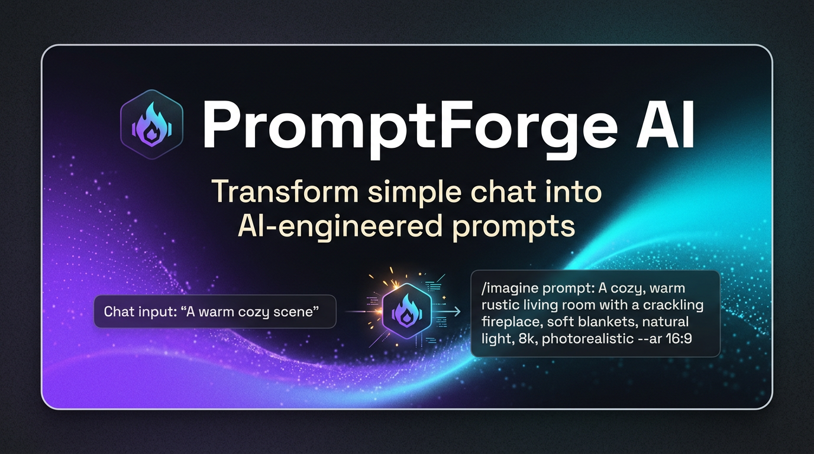

# PromptForge AI

> Transform simple chat into AI-engineered prompts. Open-source prompt engineering platform that brings out the full potential of every AI interaction.



## Live Demo

[https://7blxgj5xz6ruo.kimi.page](https://7blxgj5xz6ruo.kimi.page)

## What is PromptForge AI?

PromptForge AI is an open-source, developer-first platform that transforms your simple messages into expertly crafted prompts using advanced prompt engineering techniques. It doesn't just send your text to an AI — it **engineers** it for maximum effectiveness.

### Core Features

- **6 Prompt Engineering Techniques**: Chain-of-Thought, Few-Shot, Role Prompting, Context Injection, Output Formatting, and Meta-Prompting — toggle them individually or let the AI auto-select the best combination.
- **Side-by-Side Interface**: See your original message and the enhanced prompt side-by-side with a visual diff viewer.
- **Template Library**: 20+ curated, battle-tested prompt templates across Writing, Coding, Analysis, Creative, Business, and Education categories.
- **Self-Improvement Analytics**: Track prompt effectiveness over time, technique performance, and collect feedback to continuously improve.
- **Quality Scoring**: Every enhanced prompt gets a quality score so you know exactly how much improvement was applied.

### Prompt Engineering Techniques

| Technique | What It Does |
|-----------|-------------|
| Chain-of-Thought (CoT) | Breaks complex problems into step-by-step reasoning |
| Few-Shot | Provides examples to guide the AI's output style |
| Role Prompting | Assigns an expert persona for domain-specific responses |
| Context Injection | Adds relevant background and constraints |
| Output Formatting | Structures the response with headers, code blocks, etc. |
| Meta-Prompting | Adds self-correction and quality-check instructions |

## Tech Stack

- **Frontend**: React 19 + TypeScript + Vite
- **Styling**: Tailwind CSS 3.4 + shadcn/ui
- **Animations**: Framer Motion + GSAP
- **Charts**: Recharts
- **Icons**: Lucide React
- **Fonts**: Space Grotesk, Inter, JetBrains Mono

## Getting Started

### Prerequisites

- Node.js 20+
- npm or yarn

### Installation

```bash
# Clone the repository
git clone https://github.com/yourusername/promptforge-ai.git
cd promptforge-ai

# Install dependencies
npm install

# Start the development server
npm run dev
```

The app will be available at `http://localhost:5173`.

### Building for Production

```bash
npm run build
```

The production build will be in the `dist/` directory.

## Project Structure

```
promptforge-ai/
├── public/                 # Static assets (images, SVGs)
├── src/
│   ├── components/
│   │   ├── ui/            # shadcn/ui components
│   │   ├── forge/         # Forge page components
│   │   ├── templates/     # Templates page components
│   │   ├── analytics/     # Analytics page components
│   │   └── settings/      # Settings page components
│   ├── hooks/             # Custom React hooks
│   ├── lib/               # Utility functions and data
│   ├── pages/             # Page components
│   ├── App.tsx            # Main app with routing
│   └── main.tsx           # Entry point
├── index.html
├── tailwind.config.js
├── vite.config.ts
└── package.json
```

## Pages

| Page | Route | Description |
|------|-------|-------------|
| Landing | `/` | Feature showcase, interactive demo, open-source CTA |
| Forge | `/#/forge` | Core chat interface with prompt engineering |
| Templates | `/#/templates` | Curated prompt template library |
| Analytics | `/#/analytics` | Self-improvement dashboard with metrics |
| Settings | `/#/settings` | API keys, model selection, preferences |

## Connecting to Real AI APIs

PromptForge AI includes a mock prompt enhancement engine for demonstration. To connect to real AI providers:

1. Go to **Settings > API Keys**
2. Add your API key for OpenAI, Anthropic, or Google
3. Select your preferred model in **Settings > Model**
4. Start forging prompts!

The prompt enhancement engine works by wrapping your input with the selected techniques before sending to the AI API, dramatically improving response quality.

## Self-Improvement System

PromptForge AI learns and improves over time through:

- **User Feedback**: Thumbs up/down ratings on enhanced prompts
- **Effectiveness Tracking**: Quality scores and satisfaction metrics over time
- **Technique Analytics**: Which techniques work best for different prompt types
- **Historical Learning**: Usage patterns inform future auto-selection

## Contributing

We welcome contributions! Here's how you can help:

1. **Star the repo** to show your support
2. **Report bugs** by opening an issue
3. **Suggest features** through GitHub discussions
4. **Submit PRs** for bug fixes or new features

### Development Workflow

```bash
# Fork and clone
git clone https://github.com/yourusername/promptforge-ai.git

# Create a branch
git checkout -b feature/your-feature

# Make your changes and commit
git add .
git commit -m "feat: add your feature"

# Push and open a PR
git push origin feature/your-feature
```

### Areas for Contribution

- [ ] Connect real AI APIs (OpenAI, Anthropic, Google)
- [ ] Add more prompt engineering techniques
- [ ] Expand template library
- [ ] Add user authentication
- [ ] Cloud sync for history and settings
- [ ] Browser extension for quick prompt enhancement
- [ ] Mobile app (React Native)
- [ ] Multi-language support
- [ ] Plugin system for custom techniques

## Roadmap

- **v1.1**: Real API integration with OpenAI, Anthropic, Google
- **v1.2**: User accounts and cloud sync
- **v1.3**: Chrome extension
- **v2.0**: Plugin marketplace for custom techniques
- **v2.5**: Team collaboration features
- **v3.0**: AI-powered technique auto-optimization

## License

MIT License — see [LICENSE](LICENSE) for details.

## Acknowledgments

Built with:
- [React](https://react.dev)
- [Tailwind CSS](https://tailwindcss.com)
- [shadcn/ui](https://ui.shadcn.com)
- [Framer Motion](https://www.framer.com/motion)
- [Recharts](https://recharts.org)

---

Made with by the PromptForge AI community.
